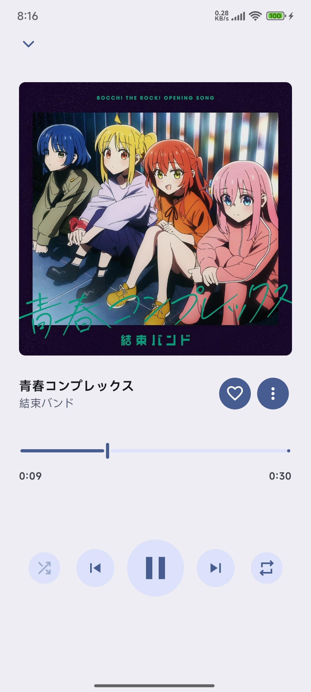

# JetMelo

A Material 3 Netease Cloud Music client for Android

## Features

- Play songs from Netease Cloud Music
- Background playback
- Search songs, albums, and playlists from Cloud Netease Music
- Login support
- Synchronized lyrics
- Personalized quick picks

## Screenshot:

<table>
  <tr>
    <td></td>
    <td></td>
    <td></td>
  </tr>
  <tr>
    <td></td>
    <td></td>
    <td></td>
  </tr>
  <tr>
    <td></td>
    <td></td>
    <td></td>
  </tr>
</table>

## Credit:

- [InnerTune](https://github.com/z-huang/InnerTune)
- [Protobuf](https://github.com/protocolbuffers/protobuf)
- [Reorderable](https://github.com/Calvin-LL/Reorderable)
- [Ktor](https://github.com/ktorio/ktor)
- [Coil](https://github.com/coil-kt/coil)
- [Ksp](https://github.com/google/ksp)

## Disclaimer

This software is not affiliated with, funded, authorized, or endorsed by NetEase Cloud Music, Hangzhou NetEase Cloud Music Technology Co., or any of its affiliates.

This software does not provide any VIP audio decryption or unlocking services. You must obtain the appropriate membership on the respective platform to access such content.

This software is for learning and communication purposes only and should not be used for commercial purposes.

Any trademarks, service marks, trade names, or other intellectual property rights used in this software belong to their respective owners.